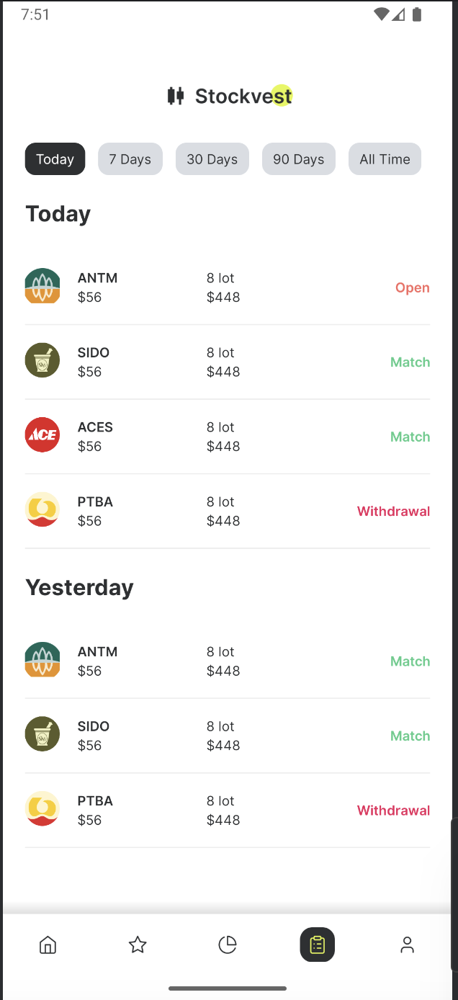
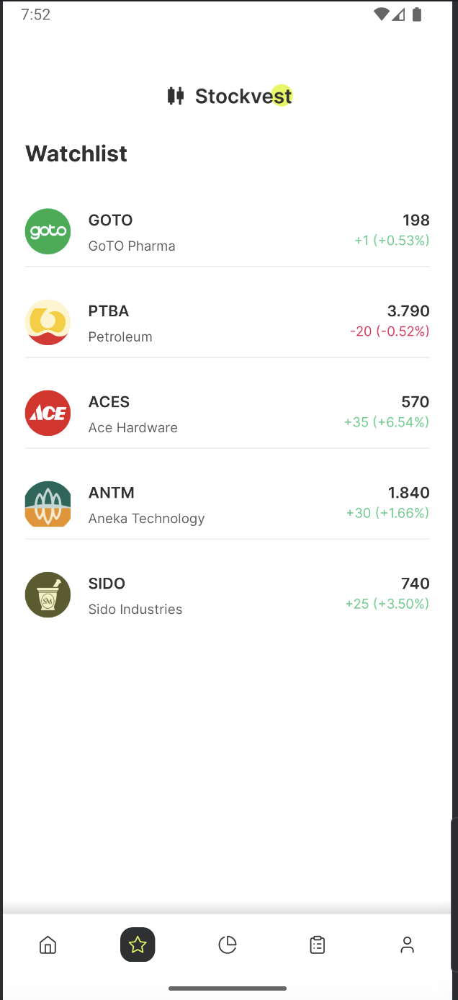

# 📈 StockVest - Smart Stock Investment Simulator

Welcome to **StockVest**, a stock market simulation tool that helps users make informed investment decisions. Whether you're a beginner looking to learn the basics or an experienced investor testing strategies, StockVest provides a realistic and data-driven experience.

## 🚀 Features
- 📊 **Real-time Market Data** – Get up-to-date stock prices and trends.
- 🏦 **Virtual Portfolio** – Simulate investments without real financial risk.
- 📉 **Performance Analytics** – Track your gains, losses, and investment trends.
- 📡 **News & Sentiment Analysis** – Stay informed with relevant market news.
- 🛠 **User-friendly Interface** – Simple, intuitive design for seamless trading.

## 📷 Demo


## 📂 Installation
To set up StockVest locally, follow these steps:

```sh
# Clone the repository
git clone https://github.com/imchillguy/StockVest.git
```

## 🎯 Usage
1. Start the application and log in or create a profile.
2. Browse stocks, analyze trends, and select assets for investment.
3. Make virtual trades and manage your portfolio.
4. Track performance and optimize your strategy.

## 📷 Screenshots

   

   